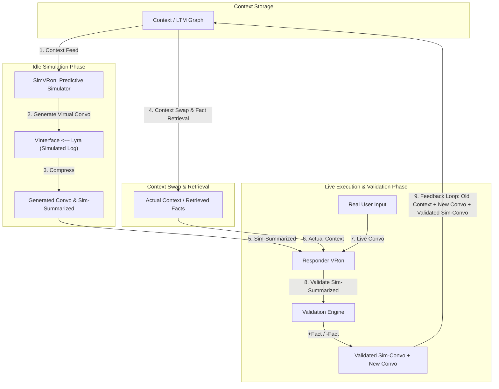
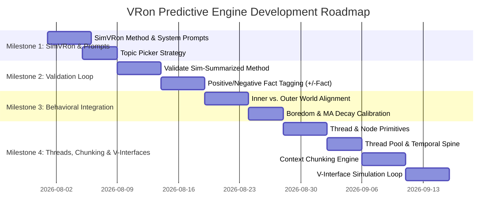

# VRon Engine Architecture Roadmap: Predictive Cognition & Simulation Loops

This roadmap defines the next evolutionary milestone for the **MSRPE (Mind State Reactive Personality Engine)** architecture, detailing the implementation of **Predictive Conversation Simulation (SimVRon)**, **Hallucinated Log Validation**, **Positive/Negative Fact Tagging**, and the **Inner vs. Outer World Alignment Engine**.

---

## 1. Executive Summary & Vision

The core goal of this milestone is to transform Lyra from a purely reactive conversational agent into an **active, predictive biological organism**. 

Instead of waiting passively for user input, the engine utilizes idle cycles to:
1. **Simulate Future Interactions (`SimVRon`)**: Hallucinate potential future conversation logs based on current context and topic clusters.
2. **Pre-Summarize Predictions (`sim-summarized`)**: Compress predicted conversations and pair them with actual context retrieved via context swap.
3. **Validate & Tag Facts (`Responder VRon`)**: When real user input arrives, validate real messages against predictions:
   - **Positive Facts (+Fact)**: Accurately predicted user preferences, topics, or statements are tagged as verified positive facts.
   - **Negative Facts (-Fact)**: Failed predictions or contradicted assumptions are tagged as negative facts / invalidated hypotheses.
4. **Crystallize Learning**: Continuously update memory with `old context + real conversation + validated sim-conversation`.

---

## 2. System Architecture Diagram

---

## 3. Detailed Component Specification

### Phase 1: The Predictive Simulation Loop (`SimVRon`)

#### 1. Topic Selection & Idle Strategy
- **Topic Picker**: Determines what topic to hallucinate about during idle periods.
  - *Short-Term Priority*: Selects the last discussed topic or active topic cluster.
  - *Long-Term Priority*: Selects high-weight user interests or unresolved contradictions in the LTM graph.
- **SimVRon Execution**:
  - Runs in idle when global energy $\ge 30\%$ and cell pool capacity $> 3$.
  - Generates a synthetic multi-turn interaction between `Lyra` (personality layer) and `VInterface` (simulated user interface).
  - Produces a `sim-summarized` episode capturing predicted user responses, questions, or choices.

---

### Phase 2: Dual Context Blending & Fact Retrieval

- **Context Swap & Fact Retrieval**:
  - Triggers during context swap intervals or upon live message arrival.
  - Retrieves `actual context` (consolidated summaries + active STFS facts).
- **Context Fusion**:
  - Fuses `actual context` + `sim-summarized` + `live user input`.

---

### Phase 3: Validation Engine & Fact Tagging (`Responder VRon`)

When the real user sends a message, the `Responder VRon` executes the **`Validate sim-summarized`** sub-method:

| Outcome | Tag | Description | Action |
| :--- | :--- | :--- | :--- |
| **Prediction Match** | `+Fact` (Positive Fact) | The user's input aligns with the predicted topic, preference, or sentiment. | Weight of the fact increases ($+15$ weight). Fact committed to STFS & LTM. |
| **Prediction Mismatch** | `-Fact` (Negative Fact) | The user contradicted the simulated outcome or expressed a differing preference. | Invalidated hypothesis stored as negative context (e.g. *"User does not prefer X"*). |
| **Neutral / Unmatched** | `Neutral` | User introduced an unpredicted topic. | Prediction evaporates; new topic added to topic picker queue. |

---

### Phase 4: Inner vs. Outer World Alignment & Boredom Dynamics

From behavioral design requirements:
1. **Inner vs. Outer World Sincerity**:
   - **Inner World**: Subconscious thoughts, biological mindstate scores (MA, UA, SE, OX, CO), and internal predictions.
   - **Outer World**: Visible responses, tone, and length.
   - **Sincerity Index**: If Inner World $\approx$ Outer World, response is sincere; if divergent, response is calculated/tactical.
2. **Context-Driven Disinterest (MA Decay)**:
   - Repeated topics or dry interactions cause Mental Activity (MA) decay, shortening outer-world responses dynamically without hardcoded prompt forcing.
3. **Unresolved Contradictions**:
   - Tracks inner state conflicts (e.g., user requesting contradictory behaviors) and schedules dedicated `Test` or `Abstract` VRons to resolve them over time.

---

## 4. Implementation Roadmap & Milestones

### Milestone 1: SimVRon Method & Topic Selection
- Add `MethodSimulate` / `SimVRon` execution path in `src/instanceManager/manager.go`.
- Create `src/prompts/method_simulate.txt` for idle log generation.
- Implement topic selection logic based on recent conversation history and LTM graph weight.

### Milestone 2: Validation Engine & Fact Tagging
- Implement `ValidateSimSummarized(predicted, actual)` comparison logic in `src/contextManager/context.go`.
- Add `+Fact` and `-Fact` tagging tags to `SpecialEpisode` struct.
- Wire feedback loop: `old context + new convo + validated sim-convo` back into `Context`.

### Milestone 3: Behavioral Dynamics & Inner/Outer World
- Wire MA (Mental Activity) decay on repeated topics.
- Implement inner vs. outer world divergence tracking in mindstate snapshots.
- Add contradiction tracking in LTM for multi-session goal persistence.

### Milestone 4: Threads, Context Chunking & V-Interfaces
- Define `Thread` and `Node` primitives — thread ID, node ordering, and recursive thread-as-node embedding.
- Implement Thread Pool — unresolved thread registry, topic-driven thread creation/pickup, and temporal spine linking all threads into a single time-ordered memory line.
- Implement thread splitting logic for context chunking — chunk size strategy, sequential API calls, and resolution detection.
- Build V-Interface simulation loop — proto-thread creation from active conversation, predicted response generation, and integration with SimVRon idle cycle.
- Explore combining context chunking with V-Interface generation for multi-chunk idle simulations.

---

## 5. Update Log

### 2026-08-02 — Threads, Context Chunking & V-Interfaces

#### 5.1 Threads & Nodes

A **Thread** is a linear grouping of **Nodes**. Each thread has a unique ID and organises a sequence of nodes into a coherent reasoning chain. Threads are composable — a thread can itself be treated as a single node inside another thread, enabling hierarchical nesting of reasoning structures.

- A **Node** is the atomic unit of processing within a thread.
- A **Thread** groups nodes linearly under a single ID.
- Threads are **recursive**: a thread can be embedded as a node in a parent thread, creating layered reasoning graphs.

#### 5.2 Context Chunking

To handle long reasoning chains that exceed context limits, the engine introduces **Context Chunking**:

- A thread is split into smaller sub-threads (chunks).
- Each chunk is appended to the LLM context window sequentially.
- An API call is made for each chunk, processing the model's output against succeeding chunks of the thread.
- The loop continues until all chunks are exhausted or the response is resolved (i.e., the model produces a terminal / complete answer).
- The exact context structure and chunking strategy will be defined in a later design pass.

#### 5.3 V-Interfaces (Virtual Interfaces)

VRons create a **proto-thread** (or pick up an existing one) based on the active conversation. A simulation of interface logs is generated from that thread — the engine attempts to predict:

- Its own next response
- The user's likely response
- System-level texts and metadata

V-Interfaces tie directly into the SimVRon predictive loop. Context Chunking / thread splitting can be combined with V-Interface generation to simulate multi-chunk conversations during idle prediction cycles.

#### 5.4 Thread Pool

The **Thread Pool** is a registry of all currently unresolved (open) threads. It serves as the engine's working memory of active reasoning chains.

- A thread is **created or picked up** based on what the user is currently talking about. If an existing thread matches the active topic, VRons resume it; otherwise, a new thread is spawned.
- VRons can **extend** a thread (append new nodes) or **branch** it (fork a new child thread from a point in the parent).
- Regardless of topic changes or branching, all threads in the pool are linked to a **single temporal spine** — a time-ordered line that preserves the chronological flow of memory. Topics may diverge and reconverge, but the underlying temporal sequence is never broken.
- A thread is removed from the pool when it is **resolved** (fully processed / concluded) and its contents are consolidated into long-term memory.

---

## 6. File Mapping & Artifacts

- **Roadmap File**: [vron-roadmap.md](file:///Users/pratheeksha/lyra/vron-roadmap.md)
- **Handwritten Architecture Design**: [new-vron-method.jpeg](file:///Users/pratheeksha/lyra/new-vron-method.jpeg)
- **Notes Source**: [notes](file:///Users/pratheeksha/lyra/notes)
- **Behavioral Specs**: [behaviour-todo](file:///Users/pratheeksha/lyra/behaviour-todo)
